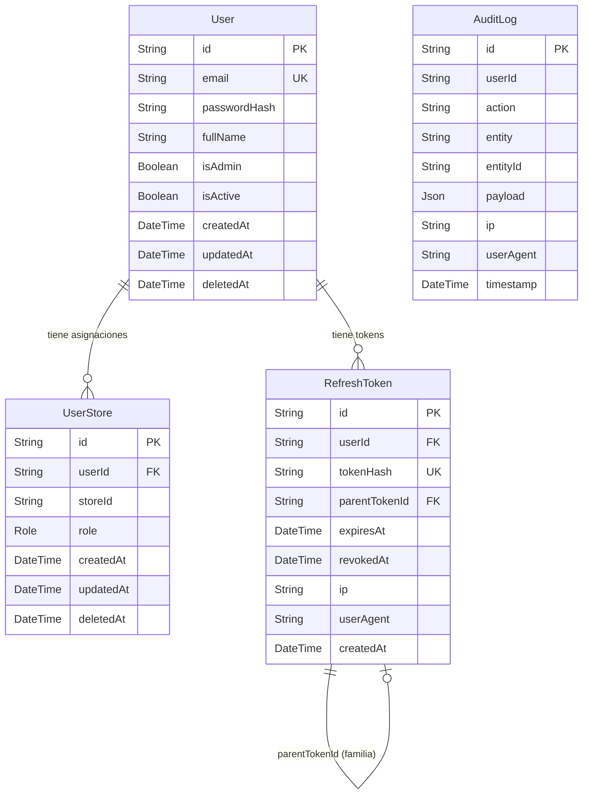

# 05 — Modelo de Datos

---

## 1. Tecnología y convenciones

El modelo de datos está definido en `apps/api/prisma/schema.prisma` y gestionado con **Prisma ORM 5**. Las convenciones del esquema son:

- Nombres de modelos en **PascalCase singular** (ej. `User`, `UserStore`).
- Tablas en base de datos en **snake_case plural** con `@@map` (ej. `users`, `user_stores`).
- Campos en **camelCase**; columnas en **snake_case** con `@map`.
- El campo `id` es de tipo `String` con `@default(cuid())` en todos los modelos.
- Los timestamps de auditoría (`createdAt`, `updatedAt`) están presentes en todos los modelos.
- Soft-delete: `deletedAt DateTime?` en `User` y `UserStore`; no en `RefreshToken` ni `AuditLog`.

---

## 2. Diagrama ER



> **Nota:** La relación `UserStore → Store` se materializa en la Feature 002. En esta iteración, `storeId` es un `String` libre que referencia un identificador de sede futuro.

---

## 3. Modelos

### 3.1 `User`

Representa a cualquier persona con acceso al sistema.

| Campo | Tipo | Descripción |
|-------|------|-------------|
| `id` | `String` (cuid) | Identificador único |
| `email` | `String` (unique) | Email normalizado a minúsculas en el input |
| `passwordHash` | `String` | Hash bcrypt (12 rondas por defecto) |
| `fullName` | `String` | Nombre completo (máx. 120 caracteres) |
| `isAdmin` | `Boolean` | `true` = admin global; `false` = encargada o vendedora |
| `isActive` | `Boolean` | `false` = cuenta desactivada; no puede iniciar sesión |
| `deletedAt` | `DateTime?` | Soft-delete; `null` = no eliminado |
| `createdAt` | `DateTime` | Fecha de creación (autogenerada) |
| `updatedAt` | `DateTime` | Fecha de última modificación (autogenerada) |

**Índices:**
- `email` — para el lookup de login y pre-check de duplicado.
- `(isActive, isAdmin)` — para el listado filtrado de usuarios.

**Relaciones:**
- `assignments: UserStore[]` — asignaciones activas del usuario.
- `refreshTokens: RefreshToken[]` — tokens de refresco del usuario.

**Invariantes de negocio:**
- Un usuario con `isAdmin = true` no puede tener asignaciones de tienda.
- No se puede desactivar ni demotar al último admin activo del sistema.
- Al desactivar un usuario, todos sus refresh tokens son revocados inmediatamente.

---

### 3.2 `UserStore`

Tabla de unión entre `User` y una sede (store), con un rol asociado. Representa el permiso de un usuario no-admin sobre una tienda específica.

| Campo | Tipo | Descripción |
|-------|------|-------------|
| `id` | `String` (cuid) | Identificador único |
| `userId` | `String` (FK) | Referencia al `User` |
| `storeId` | `String` | Identificador de la sede (FK a `Store` en Feature 002) |
| `role` | `Role` | `encargada` o `vendedora` |
| `deletedAt` | `DateTime?` | Soft-delete |
| `createdAt` | `DateTime` | Fecha de creación |
| `updatedAt` | `DateTime` | Fecha de última modificación |

**Clave única compuesta:** `(userId, storeId, deletedAt)` — permite crear una nueva asignación para la misma combinación usuario-tienda después de eliminar la anterior (gracias a que `deletedAt` es parte de la clave y tiene valor distinto en cada fila eliminada).

**Índices:**
- `userId` — para listar asignaciones de un usuario.
- `storeId` — para listar usuarios de una tienda.

---

### 3.3 `RefreshToken`

Almacena los refresh tokens emitidos. Solo se guarda el **hash SHA-256** del token, nunca el valor en claro.

| Campo | Tipo | Descripción |
|-------|------|-------------|
| `id` | `String` (cuid) | Identificador único |
| `userId` | `String` (FK) | Usuario dueño del token |
| `tokenHash` | `String` (unique) | SHA-256 del token opaco |
| `parentTokenId` | `String?` (FK self) | Token previo en la cadena de rotación (familia) |
| `expiresAt` | `DateTime` | Fecha de expiración (7 días por defecto) |
| `revokedAt` | `DateTime?` | Fecha de revocación; `null` = activo |
| `ip` | `String?` | IP desde la que se emitió |
| `userAgent` | `String?` | User-Agent del cliente |
| `createdAt` | `DateTime` | Fecha de creación |

**Familia de tokens:** al rotar un refresh token, el nuevo tiene `parentTokenId = id_del_anterior`. Si se detecta un replay (token revocado presentado nuevamente), se revocan todos los tokens de la familia llamando a `refreshTokens.revokeFamily(tokenId)`.

**Limpieza:** el cron `startRefreshTokenCleanup` (en `jobs/refreshTokenCleanup.ts`) elimina físicamente los tokens con `expiresAt` anterior a 30 días, evitando el crecimiento indefinido de la tabla.

**Índice principal:** `(userId, revokedAt, expiresAt)` — para las consultas de validación de token activo.

---

### 3.4 `AuditLog`

Registro inmutable de eventos del sistema. No tiene `updatedAt` ni `deletedAt`; los registros nunca se modifican ni se eliminan en el flujo normal.

| Campo | Tipo | Descripción |
|-------|------|-------------|
| `id` | `String` (cuid) | Identificador único |
| `userId` | `String?` | Usuario que realizó la acción (puede ser null para eventos de sistema) |
| `action` | `String` | Nombre del evento (ej. `AUTH_LOGIN_SUCCESS`) |
| `entity` | `String` | Entidad afectada (ej. `User`, `UserStore`, `RefreshToken`) |
| `entityId` | `String?` | ID de la entidad afectada |
| `payload` | `Json` | Datos adicionales del evento (formato libre por acción) |
| `ip` | `String?` | IP del request |
| `userAgent` | `String?` | User-Agent del request |
| `timestamp` | `DateTime` | Momento del evento (autogenerado) |

**Índices:**
- `(userId, timestamp)` — para consultar historial de un usuario.
- `(entity, entityId)` — para consultar eventos sobre una entidad específica.
- `(action, timestamp)` — para consultar eventos de un tipo en un período.

---

### 3.5 Enum `Role`

```prisma
enum Role {
  encargada
  vendedora
  @@map("user_role")
}
```

El rol `admin` no es un valor del enum sino un flag booleano (`isAdmin`) en `User`. Esta decisión evita una categoría especial en la tabla de asignaciones y simplifica las queries de autorización.

---

## 4. Estrategia de migraciones

Prisma gestiona las migraciones en `apps/api/prisma/migrations/`. El flujo es:

- **Desarrollo:** `prisma migrate dev` — genera una nueva migración SQL a partir del diff del schema y la aplica.
- **Producción / CI:** `prisma migrate deploy` — aplica las migraciones pendientes sin interactividad.
- **Estado actual:** una migración registrada: `20260425035147_001_init_auth` (schema completo de Feature 001).

El archivo `migration_lock.toml` registra el proveedor de base de datos (`postgresql`) y actúa como checksum de integridad del historial de migraciones.

---

## 5. Entidades planificadas — Features 002-009

Las siguientes entidades serán agregadas en futuras features. Se listan aquí para que el tribunal pueda evaluar la coherencia del modelo de dominio completo.

| Entidad | Feature | Descripción |
|---------|---------|-------------|
| `Store` | 002 | Sede (nombre, tipo: `tienda` / `almacen`, activa) |
| `Product` | 003 | Producto con código corto (ej. `MXS123DSA`) y nombre |
| `Variant` | 003 | (producto + talla + color) con barcode único, precio opcional, imagen opcional |
| `StockEntry` | 004 | Stock de una variante en una sede (quantity) |
| `StockMovement` | 004 | Movimiento de inventario por sede (tipo, cantidad, motivo) |
| `Delivery` | 005 | Transferencia de variantes del almacén a una tienda |
| `DeliveryItem` | 005 | Línea de entrega (variante + cantidad) |
| `Sale` | 006 | Venta registrada en una tienda (método de pago, total, vendedora) |
| `SaleItem` | 006 | Línea de venta (variante + cantidad + precio unitario) |
| `DailyReport` | 007 | Reporte diario inmutable por sede (totales por método de pago) |
| `WeeklyReport` | 008 | Reporte semanal agregado para admin |

La relación `UserStore.storeId → Store.id` se materializará como FK en la Feature 002, sin necesidad de migración de datos existentes (el campo ya existe como `String` libre).
