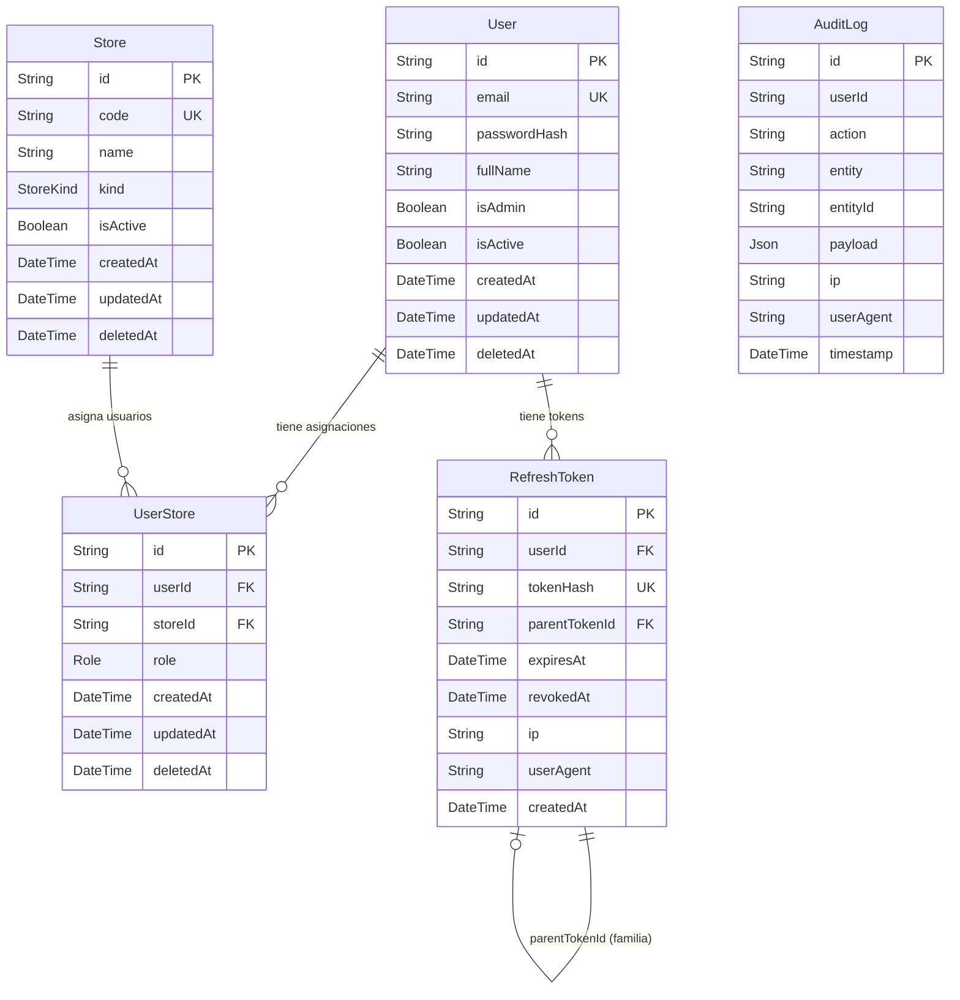

# 05 — Modelo de Datos

---

## 1. Tecnología y convenciones

El modelo de datos está definido en `apps/api/prisma/schema.prisma` y gestionado con **Prisma ORM 5**. Las convenciones del esquema son:

- Nombres de modelos en **PascalCase singular** (ej. `User`, `UserStore`, `Store`).
- Tablas en base de datos en **snake_case plural** con `@@map` (ej. `users`, `user_stores`, `stores`).
- Campos en **camelCase**; columnas en **snake_case** con `@map`.
- El campo `id` es de tipo `String` con `@default(cuid())` en todos los modelos.
- Los timestamps de auditoría (`createdAt`, `updatedAt`) están presentes en todos los modelos.
- Soft-delete: `deletedAt DateTime?` en `User`, `UserStore` y `Store`; no en `RefreshToken` ni `AuditLog`.

---

## 2. Diagrama ER



> **Feature 002:** la relación `UserStore.storeId → Store.id` está materializada como FK con `ON DELETE RESTRICT, ON UPDATE CASCADE`. La invariante de bloqueo de desactivación con asignaciones activas vive en el servicio (defensa en profundidad: el `RESTRICT` también la respalda a nivel DB).

---

## 3. Modelos

### 3.1 `User`

Representa a cualquier persona con acceso al sistema.

| Campo | Tipo | Descripción |
|-------|------|-------------|
| `id` | `String` (cuid) | Identificador único |
| `email` | `String` (unique) | Email normalizado a minúsculas en el input |
| `passwordHash` | `String` | Hash bcrypt (12 rondas por defecto) |
| `fullName` | `String` | Nombre completo (máx. 120 caracteres) |
| `isAdmin` | `Boolean` | `true` = admin global; `false` = encargada o vendedora |
| `isActive` | `Boolean` | `false` = cuenta desactivada; no puede iniciar sesión |
| `deletedAt` | `DateTime?` | Soft-delete; `null` = no eliminado |
| `createdAt` | `DateTime` | Fecha de creación (autogenerada) |
| `updatedAt` | `DateTime` | Fecha de última modificación (autogenerada) |

**Índices:**
- `email` — para el lookup de login y pre-check de duplicado.
- `(isActive, isAdmin)` — para el listado filtrado de usuarios.

**Relaciones:**
- `assignments: UserStore[]` — asignaciones activas del usuario.
- `refreshTokens: RefreshToken[]` — tokens de refresco del usuario.

**Invariantes de negocio:**
- Un usuario con `isAdmin = true` no puede tener asignaciones de tienda.
- No se puede desactivar ni demotar al último admin activo del sistema.
- Al desactivar un usuario, todos sus refresh tokens son revocados inmediatamente.

---

### 3.2 `UserStore`

Tabla de unión entre `User` y una sede (store), con un rol asociado. Representa el permiso de un usuario no-admin sobre una tienda específica.

| Campo | Tipo | Descripción |
|-------|------|-------------|
| `id` | `String` (cuid) | Identificador único |
| `userId` | `String` (FK) | Referencia al `User` |
| `storeId` | `String` (FK) | Referencia a la `Store` (FK con `ON DELETE RESTRICT, ON UPDATE CASCADE`) |
| `role` | `Role` | `encargada` o `vendedora` |
| `deletedAt` | `DateTime?` | Soft-delete |
| `createdAt` | `DateTime` | Fecha de creación |
| `updatedAt` | `DateTime` | Fecha de última modificación |

**Clave única compuesta:** `(userId, storeId, deletedAt)` — permite crear una nueva asignación para la misma combinación usuario-tienda después de eliminar la anterior (gracias a que `deletedAt` es parte de la clave y tiene valor distinto en cada fila eliminada).

**Índices:**
- `userId` — para listar asignaciones de un usuario.
- `storeId` — para listar usuarios de una tienda.

---

### 3.3 `RefreshToken`

Almacena los refresh tokens emitidos. Solo se guarda el **hash SHA-256** del token, nunca el valor en claro.

| Campo | Tipo | Descripción |
|-------|------|-------------|
| `id` | `String` (cuid) | Identificador único |
| `userId` | `String` (FK) | Usuario dueño del token |
| `tokenHash` | `String` (unique) | SHA-256 del token opaco |
| `parentTokenId` | `String?` (FK self) | Token previo en la cadena de rotación (familia) |
| `expiresAt` | `DateTime` | Fecha de expiración (7 días por defecto) |
| `revokedAt` | `DateTime?` | Fecha de revocación; `null` = activo |
| `ip` | `String?` | IP desde la que se emitió |
| `userAgent` | `String?` | User-Agent del cliente |
| `createdAt` | `DateTime` | Fecha de creación |

**Familia de tokens:** al rotar un refresh token, el nuevo tiene `parentTokenId = id_del_anterior`. Si se detecta un replay (token revocado presentado nuevamente), se revocan todos los tokens de la familia llamando a `refreshTokens.revokeFamily(tokenId)`.

**Limpieza:** el cron `startRefreshTokenCleanup` (en `jobs/refreshTokenCleanup.ts`) elimina físicamente los tokens con `expiresAt` anterior a 30 días, evitando el crecimiento indefinido de la tabla.

**Índice principal:** `(userId, revokedAt, expiresAt)` — para las consultas de validación de token activo.

---

### 3.4 `AuditLog`

Registro inmutable de eventos del sistema. No tiene `updatedAt` ni `deletedAt`; los registros nunca se modifican ni se eliminan en el flujo normal.

| Campo | Tipo | Descripción |
|-------|------|-------------|
| `id` | `String` (cuid) | Identificador único |
| `userId` | `String?` | Usuario que realizó la acción (puede ser null para eventos de sistema) |
| `action` | `String` | Nombre del evento (ej. `AUTH_LOGIN_SUCCESS`) |
| `entity` | `String` | Entidad afectada (ej. `User`, `UserStore`, `RefreshToken`) |
| `entityId` | `String?` | ID de la entidad afectada |
| `payload` | `Json` | Datos adicionales del evento (formato libre por acción) |
| `ip` | `String?` | IP del request |
| `userAgent` | `String?` | User-Agent del request |
| `timestamp` | `DateTime` | Momento del evento (autogenerado) |

**Índices:**
- `(userId, timestamp)` — para consultar historial de un usuario.
- `(entity, entityId)` — para consultar eventos sobre una entidad específica.
- `(action, timestamp)` — para consultar eventos de un tipo en un período.

---

### 3.5 Enum `Role`

```prisma
enum Role {
  encargada
  vendedora
  @@map("user_role")
}
```

El rol `admin` no es un valor del enum sino un flag booleano (`isAdmin`) en `User`. Esta decisión evita una categoría especial en la tabla de asignaciones y simplifica las queries de autorización.

---

### 3.6 `Store` (Feature 002)

Representa una sede física del negocio: el almacén central o una sucursal de venta.

| Campo | Tipo | Descripción |
|-------|------|-------------|
| `id` | `String` (cuid) | Identificador único |
| `code` | `String` (unique) | Código corto en MAYÚSCULAS, dígitos o `_` (ej. `PRADO`, `ZSUR`) |
| `name` | `String` | Nombre legible (ej. `Sucursal Prado`) |
| `kind` | `StoreKind` | `warehouse` (almacén central) o `branch` (sucursal) |
| `isActive` | `Boolean` | Estado operacional reversible; distinto a `deletedAt` |
| `deletedAt` | `DateTime?` | Soft-delete |
| `createdAt` / `updatedAt` | `DateTime` | Auditoría temporal |

**Índices:**
- `code` UNIQUE — para búsquedas por código y prevención de duplicados.
- `(isActive, kind)` — cubre el patrón principal de listado (sucursales activas).

**Relaciones:**
- `assignments: UserStore[]` — usuarios actualmente asignados a la sede.

**Invariantes de negocio:**
- **Único almacén central activo:** sólo puede existir una `Store` con `kind = 'warehouse'` e `isActive = true` simultáneamente. La invariante se enforza en una transacción `Serializable` en el servicio (count-then-insert).
- **Bloqueo en desactivación con asignaciones:** `deactivate(storeId)` lanza `STORE_HAS_ACTIVE_ASSIGNMENTS` si existen `UserStore` activos. El admin debe reasignar a esos usuarios antes.
- **`kind` es inmutable:** una vez creada, `kind` no se puede modificar (cambiar warehouse↔branch invalidaría invariantes de inventario futuras).
- **`code` autouppercased:** el servicio normaliza el código a mayúsculas antes de persistir.

---

### 3.7 Enum `StoreKind`

```prisma
enum StoreKind {
  warehouse
  branch
  @@map("store_kind")
}
```

`warehouse` representa al almacén central (único), donde se ingresa stock proveniente de proveedores. `branch` representa una sucursal de venta al público.

---

### 3.8 `Product` (Feature 003)

Representa el "molde" de un artículo del catálogo. No tiene stock — el stock vive en feature 004 por sede.

| Campo | Tipo | Descripción |
|-------|------|-------------|
| `id` | `String` (cuid) | Identificador único |
| `code` | `String` (unique) | Código corto en MAYÚSCULAS, dígitos o `_` (ej. `JN001`, `CHQ002`); 2-15 caracteres |
| `name` | `String` | Nombre legible (ej. `Jean Bota Recta`); 2-120 caracteres |
| `description` | `String?` | Descripción opcional, hasta 500 caracteres |
| `isActive` | `Boolean` | Estado operacional reversible |
| `deletedAt` | `DateTime?` | Soft-delete |
| `createdAt` / `updatedAt` | `DateTime` | Auditoría temporal |

**Índices:**
- `code` UNIQUE
- `(isActive)` — para listados rápidos del catálogo activo

**Relaciones:**
- `variants: Variant[]` — variantes del producto

**Invariantes de negocio:**
- **Bloqueo en desactivación con variantes activas:** `deactivate(productId)` lanza `PRODUCT_HAS_ACTIVE_VARIANTS` si existen `Variant` con `isActive = true`. El admin debe desactivar variantes una a una primero.

---

### 3.9 `Variant` (Feature 003)

Combinación concreta de un producto: talla + color + precio + imagen. El barcode es la clave operacional para el scanner del feature 008.

| Campo | Tipo | Descripción |
|-------|------|-------------|
| `id` | `String` (cuid) | Identificador único |
| `productId` | `String` (FK) | Referencia al `Product` (`ON DELETE RESTRICT, ON UPDATE CASCADE`) |
| `size` | `Size` | Enum: `s, m, l, xl, xxl, 28, 30, 32, 34, standard` |
| `color` | `String` | Free string, hasta 32 caracteres (case preservado, normalizado para hash) |
| `barcode` | `String` (unique) | 12 hex uppercased, generado deterministicamente con SHA-256(`code|size|color`) |
| `priceCents` | `Int` | Precio en centavos (entero, ≥ 1, ≤ 10_000_000) — sin floats |
| `imagePath` | `String?` | Path relativo (`imagesTest/...`) o URL absoluta de Cloudinary |
| `isActive` | `Boolean` | Estado operacional reversible |
| `deletedAt` | `DateTime?` | Soft-delete |
| `createdAt` / `updatedAt` | `DateTime` | Auditoría temporal |

**Índices:**
- `barcode` UNIQUE
- `(productId, size, color, deletedAt)` UNIQUE compuesto — evita duplicados activos manteniendo soft-delete consistente
- `(productId, isActive)` — para listar variantes activas de un producto
- `(barcode)` — para búsquedas rápidas del scanner

**Invariantes de negocio:**
- **Tupla única activa:** no pueden coexistir dos `Variant` activas con la misma `(productId, size, color)`. Pre-check en el servicio antes del insert.
- **Barcode determinístico:** `SHA-256(productCode | size | color.toLowerCase())[0..12].toUpperCase()`. Mismo input → mismo barcode. Útil para reproducibilidad y para que un mismo producto pueda referenciarse desde reportes históricos.
- **`size` y `color` son inmutables:** una vez creada la variante, sólo `priceCents` e `imagePath` son mutables. Cambios de talla/color requieren desactivar y crear una nueva variante.
- **`priceCents` obligatorio en alta:** decisión del feature 003 — el precio se setea al crear, no es nullable.

---

### 3.10 Enum `Size`

```prisma
enum Size {
  s
  m
  l
  xl
  xxl
  size_28  @map("28")
  size_30  @map("30")
  size_32  @map("32")
  size_34  @map("34")
  standard

  @@map("variant_size")
}
```

Combina tallas alfabéticas (S–XXL), tallas numéricas de pantalón (28-34) y un fallback `standard` para artículos sin talla definida. **Nota técnica:** Prisma no permite identificadores que empiecen con dígito; los valores numéricos se mapean al literal de la base con `@map("28")`. La capa de contratos expone los literales públicos `'28' | '30' | '32' | '34'`.

---

### 3.11 Almacenamiento de imágenes (estrategia)

Configurable via `IMAGE_STORAGE` env:

- **`local`** (dev/test default): los archivos se persisten en `<repo-root>/imagesTest/<filename>`. La DB guarda la ruta relativa (`imagesTest/<filename>`). El backend expone el directorio bajo `GET /static/images/*` SOLO en este modo.
- **`cloudinary`** (prod target): los archivos se suben a Cloudinary y la DB guarda el `secure_url` resultante. Requiere `CLOUDINARY_CLOUD_NAME`, `CLOUDINARY_API_KEY`, `CLOUDINARY_API_SECRET`.

La selección se hace en composition root, detrás de un puerto `ImageStorage` con dos adaptadores. Cambiar de modo no requiere migrar datos: ambos adaptadores leen lo que esté en `imagePath`.

---

## 4. Estrategia de migraciones

Prisma gestiona las migraciones en `apps/api/prisma/migrations/`. El flujo es:

- **Desarrollo:** `prisma migrate dev` — genera una nueva migración SQL a partir del diff del schema y la aplica.
- **Producción / CI:** `prisma migrate deploy` — aplica las migraciones pendientes sin interactividad.
- **Estado actual:** tres migraciones registradas:
  - `20260425035147_001_init_auth` — schema completo de Feature 001 (User, UserStore, RefreshToken, AuditLog).
  - `20260425200000_002_init_stores` — Feature 002: enum `StoreKind`, tabla `stores`, FK `user_stores.store_id → stores.id` (`ON DELETE RESTRICT, ON UPDATE CASCADE`), seed idempotente de las 3 sedes preexistentes.
  - `20260425210000_003_init_products` — Feature 003: enum `Size`, tablas `products` y `variants`, FK `variants.product_id → products.id` (`ON DELETE RESTRICT, ON UPDATE CASCADE`), índices únicos en `code` y `barcode`, índice compuesto `(product_id, size, color, deleted_at)`.

El archivo `migration_lock.toml` registra el proveedor de base de datos (`postgresql`) y actúa como checksum de integridad del historial de migraciones.

---

## 5. Entidades planificadas — Features 004-009

Las siguientes entidades serán agregadas en futuras features. Se listan aquí para que el tribunal pueda evaluar la coherencia del modelo de dominio completo.

| Entidad | Feature | Descripción |
|---------|---------|-------------|
| `StockEntry` | 004 | Stock de una variante en una sede (quantity) |
| `StockMovement` | 004 | Movimiento de inventario por sede (tipo, cantidad, motivo) |
| `Delivery` | 005 | Transferencia de variantes del almacén a una tienda |
| `DeliveryItem` | 005 | Línea de entrega (variante + cantidad) |
| `Sale` | 006 | Venta registrada en una tienda (método de pago, total, vendedora) |
| `SaleItem` | 006 | Línea de venta (variante + cantidad + precio unitario) |
| `DailyReport` | 007 | Reporte diario inmutable por sede (totales por método de pago) |
| `WeeklyReport` | 008 | Reporte semanal agregado para admin |
